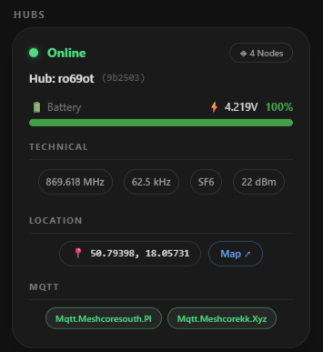
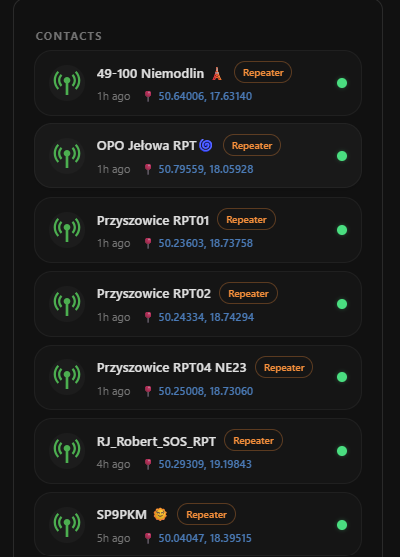

# MeshCore Card

Custom [Home Assistant](https://www.home-assistant.io/) Lovelace cards that display hub, node, contact, and channel statistics from the [MeshCore](https://meshcore.co.uk) mesh radio network integration.

[](https://github.com/jpettitt/meshcore-card/releases)
[](LICENSE)
[](https://hacs.xyz)
[](https://github.com/jpettitt/meshcore-card)

[](https://my.home-assistant.io/redirect/hacs_repository/?owner=jpettitt&repository=meshcore-card&category=plugin)




---

## Requirements

- **Home Assistant** 2023.x or later
- **[MeshCore Integration](https://github.com/meshcore-dev/meshcore-ha)** — must be installed and configured. The cards read hub, node, contact, and channel data directly from the devices and entities registered by this integration.

---

## Installation

### HACS (recommended)

1. Open **HACS** → **Frontend**
2. Click the ⋮ menu → **Custom repositories**
3. Add `https://github.com/jpettitt/meshcore-card` with category **Dashboard**
4. Search for **MeshCore Card** and install it
5. Reload your browser

### Manual

1. Download `meshcore-card.js` from the latest [GitHub Release](https://github.com/jpettitt/meshcore-card/releases)
2. Copy it to `config/www/meshcore-card.js`
3. In Home Assistant go to **Settings → Dashboards → Resources** and add `/local/meshcore-card.js` as a JavaScript module
4. Reload your browser

---

## Cards

This package provides three card types.

### `custom:meshcore-card` — Hub & Node Card

Displays all MeshCore hubs and their remote nodes, automatically discovered from the HA device and entity registry.

```yaml
type: custom:meshcore-card
```

#### Features

- **Hub status** — online/offline indicator, node count, hardware model, firmware version
- **RF parameters** — frequency, bandwidth, spreading factor, TX power
- **MQTT broker status** — per-broker connection pills (green = connected, red = disconnected)
- **Hub location** — coordinates chip with a direct link to the [MeshCore Analyzer map](https://analyzer.letsmesh.net)
- **Remote nodes** — automatically discovered:
  - Online/offline status, RSSI and SNR badges, routing path, last seen time
  - Battery percentage bar with voltage
  - Location map link (resolved from the node's contact advertisement)
  - **Repeater nodes**: TX/RX airtime bars, noise floor, uptime, TX/RX rate, relayed/canceled/duplicate traffic counts, sent/received totals
  - Optional sensor readings: temperature, humidity, illuminance, pressure (configured per node)
- **Drag-to-reorder** — drag nodes in the visual editor to set display order
- **Throttled rendering** — updates at most once every 10 seconds

#### Configuration

All options are available through the visual editor or in YAML.

```yaml
type: custom:meshcore-card
hubs:
  55733c:                         # hub identified by public key prefix
    enabled: true                 # show/hide this hub (default: true)
    battery_entity: sensor.x      # override auto-detected battery % entity
    voltage_entity: sensor.x      # override auto-detected voltage entity
nodes:
  MyNode:                         # node identified by name
    enabled: true                 # show/hide this node (default: true)
    battery_entity: sensor.x      # override auto-detected battery % entity
    voltage_entity: sensor.x      # override auto-detected voltage entity
    location_entity: sensor.x     # override location source (entity with latitude/longitude
                                  # attributes, scoped to all meshcore entities)
    temperature_entity: sensor.x  # temperature sensor to display (optional)
    humidity_entity: sensor.x     # humidity sensor to display (optional)
    illuminance_entity: sensor.x  # illuminance sensor to display (optional)
    pressure_entity: sensor.x     # pressure sensor to display (optional)
nodes_order:                      # display order for nodes (set via drag-and-drop in editor)
  - MyNode
  - OtherNode
grid_options:
  rows: 4                         # fix card height to N dashboard grid rows;
                                  # content that doesn't fit is hidden cleanly
```

**Shorthand:** `true` / `false` can be used instead of a full object to simply show or hide:

```yaml
hubs:
  55733c: true
  aabbcc: false
nodes:
  JPP: true
  YubaMonitor: false
```

---

### `custom:meshcore-contact-card` — Contact Card

Lists all `binary_sensor.meshcore_*_contact` entities sorted by most recently heard advertisement.

```yaml
type: custom:meshcore-contact-card
```

#### Contact card features

- **Contact list** — sorted by `last_advert` descending (most recently heard first)
- **Per contact**: icon or entity picture, advertised name, node type badge, time since last heard, online/offline dot
- **Location** — coordinates link to [MeshCore Analyzer map](https://analyzer.letsmesh.net) when lat/lon are present; shows "Unknown Location" when coordinates are 0,0
- **Age filter** — contacts older than `max_contact_age_days` are hidden
- **Grid-aware clipping** — when placed in a fixed-height grid cell, partially visible rows are hidden cleanly

#### Contact card configuration

```yaml
type: custom:meshcore-contact-card
max_contact_age_days: 7           # hide contacts not heard within this many days (default: 7)
grid_options:
  rows: 4                         # fix card height to N dashboard grid rows
```

---

### `custom:meshcore-channel-card` — Channel Card

Lists all active MeshCore message channels (`binary_sensor.meshcore_*_messages` entities) sorted by channel index.

```yaml
type: custom:meshcore-channel-card
```

#### Channel card features

- **Channel list** — sorted by channel index
- **Per channel**: green dot when active, hub name, channel name
- **Grid-aware clipping** — when placed in a fixed-height grid cell, partially visible rows are hidden cleanly

#### Channel card configuration

```yaml
type: custom:meshcore-channel-card
grid_options:
  rows: 4                         # fix card height to N dashboard grid rows
```

---

## Localization

The cards are localized into **English**, **French**, **Dutch**, and **German**. The active Home Assistant language is used automatically.

> **Note:** French, Dutch, and German translations are machine-generated. If you spot an error or awkward phrasing, pull requests with corrections are very welcome!

To add a new language or correct an existing one, see [`src/translations/`](src/translations/) and [`scripts/translate.mjs`](scripts/translate.mjs).

---

## License

MIT
